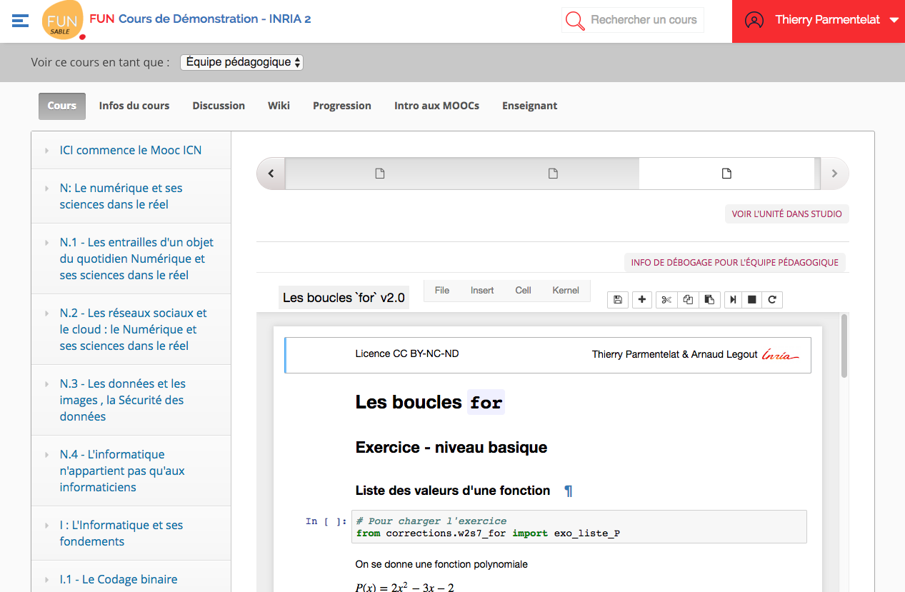
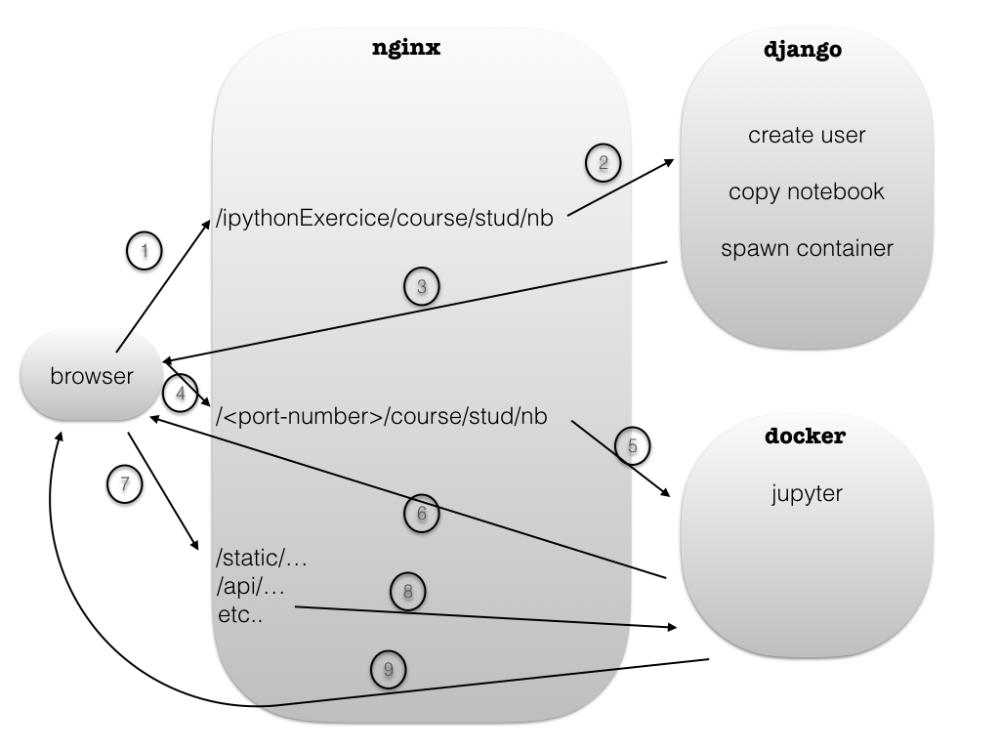

# notebook hosting architecture

This git repo contains a collection of utilities, that together make up the architecture behind `nbhosting.inria.fr` that is designed as a notebook-serving infrastructure.

First use case is for hosting notebooks in the context of MOOCs. See e.g.

* [Python : des fondamentaux à l'utilisation du langage on fun-mooc.fr](https://www.fun-mooc.fr/courses/inria/41001S03/session03/about)
* [Bioinformatique : algorithmes et génomes on fun-mooc.fr](https://www.fun-mooc.fr/courses/inria/41003S02/session02/about)

# *Open-edX* teacher side

On the edx side, teacher would create a bloc typed as *ipython notebook* - note that the present repo does not address the code for the edx extension that supports this type of blocs (ref?); it is reaily available at this point (jan. 2017) at `fun-mooc.fr`.

# *Open-edX* student side

Here's what a student would see; 

# `nbhosting` side

Here's the general principle of how of works

* Open-edX forges a URL, like the one shown above, with `student` replaced with the hash of some student id
* This is caught by nginx, that runs forefront; the `ipythonExercice/` prefix is routed to a django application, that primarily does this
  * create a linux user if needed
  * create a copy of that notebook for the student if needed
  * spawns a (docker) jupyter instance for the couple (course, student)
  * redirects to a (plain https, on port 443) URL that contains the (http/localhost) port number that the docker instance can be reached at
 
As a summary:

# TODO

A lot remains to be done, see [doc/TODO-nbhosting.md]()

